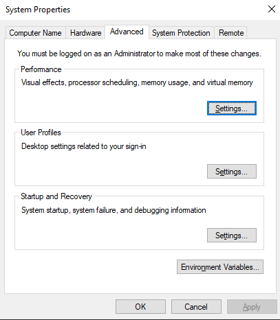

## Introduction

### React Native Intro
- Create native apps for Android, iOS, and more using React
- React Native combines the best parts of native development with React, a best-in-class JavaScript library for building user interfaces.
  
### Prerequisite
- Javscript Fundamentals.
- React knowledge would be very helpful. Although it can be learnt on the go.
- Typescript knowledge would also be very helpful. But not absolute necessary.

### Myths
- Many people don't learn this because they think setup is too much. They think their PC can't handle Android Studio.
  - The reality is that we don't need that much processing.
  - We only need to download the android studio, set some path and there is no need to use android studio or emulator after that. We can then use our physical android/iOs device to run our app.

## Installation - Windows

### Required things
- Node Js
- JDK
- Android Studio

### Steps
1. Download and install Node Js.
   - Simple processes. Just next - next - next and it will be done.
   - Check its version after installing by running `node --version` and `npm --version`
    

2. Install JDK
   -  Download JDK.
   -  Set `JAVA_HOME` variable in environment variables.
        1. Search `environment variables` in start menu.
        2. Click on `Edit the system environment variables`. The following window appears.
            
        3. Click on `Environmet Variables`. The following window apppears.
            
        4. Click on `new` in ***System Variables*** section
        5. Write `JAVA_HOME` in ***variable name*** and provide the path where we installed the jdk in ***variable value***. Click Ok.
            
        6. Now we can see the `JAVA_HOME` variable.
            
        7. Do the same in the upper section - in the ***User Variables for `user-name`*** section
            

    - Set `Path` in environment variables.
        - The first three steps are same as above.
        4. Click on `Path` variable in ***System Variables*** section
            
        5. Click on `Edit` button.
        6. Click on `New`
        7. Copy and paste the path where we installed the jdk.
        8. Click Ok.
            
        9.  Do the same in the upper section - in the ***User Variables for `user-name`*** section
            

3. Install Android Studio
   - Download Android Studio
   - Install it.
   - After Intsalling.
   - Open it.
   - Click on more actions - Click `SDK Manager`
        
   - In `SDK Platforms` tab. Select the following then click Apply.
        
   - In `SDK Tools` tab. Select the following then click Apply.
        
   - Setting Path
     - Set `ANDROID_HOME` variable in environment variables in both sections.
        
     - Set `path` in both section
       -  