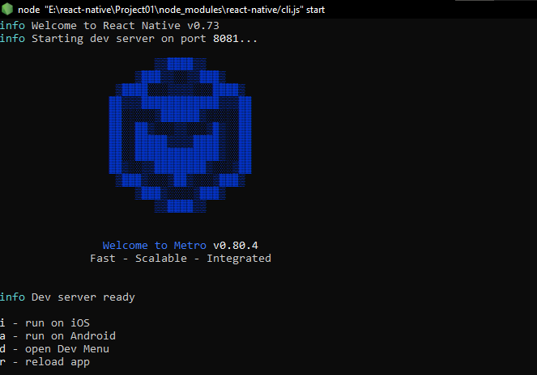

## Creating a project in React Native

- Command: `npx react-native@latest init AwesomeProject`
  - It takes around 3 minutes to create the project.
- To run the project - Go to project directory
  - Command: `npx run android` (For some reason `powershell` gives error while running this. So use other terminal: Ex. `git bash`)
  - It will take around 1 minute for a window to appear. This is the `metro window`

   
  - Type `a` on this window
  - It will take around 3-4 minutes to get the app started